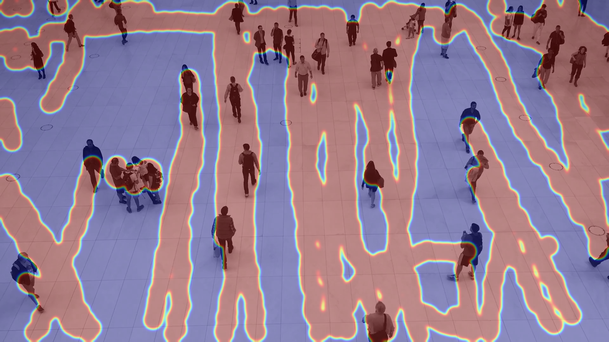

# 🧠 MotionMap: People Flow Detection using Object Tracking & Heatmap Visualization  

  
  


---

## 🎯 Project Objective
This project detects and tracks **human movement** in a video, counts people moving **IN** and **OUT**, and generates a **heatmap visualization** showing where most movement occurred.  

Using **YOLOv8** (for detection) and **BoT-SORT** (for tracking), it accurately monitors human flow and visualizes crowd activity intensity.

---

## 🧩 How It Works
1. **Detection** → YOLOv8 detects human objects frame-by-frame.  
2. **Tracking** → BoT-SORT assigns each detected person a unique tracking ID.  
3. **Counting Logic** →  
   - Crossing **upper line** = IN  
   - Crossing **lower line** = OUT  
4. **Heatmap Generation** → Each tracked position contributes to a motion density heatmap.  
5. **Output Files** →  
   - `output_video.mp4` — with bounding boxes, tracking IDs, and IN/OUT counts  
   - `heatmap.png` — color-mapped image showing hot zones of movement  

---

## ⚙️ Tech Stack
| Component | Technology |
|------------|-------------|
| Object Detection | YOLOv8 (Ultralytics) |
| Object Tracking | BoT-SORT |
| Visualization | OpenCV, NumPy |
| Language | Python 3.9+ |
| Output | MP4 Video + PNG Heatmap |

---

## 🚀 Setup Instructions

### 1️⃣ Clone Repository
```bash
git clone https://github.com/yourusername/people-flow-detection.git
cd people-flow-detection
```

### 2️⃣ Install Requirements
```bash
pip install ultralytics opencv-python numpy
```

### 3️⃣ Download Input Video  
You can use the same sample video used in this project:  
🎥 [People Walking Sample Video](https://media.roboflow.com/supervision/video-examples/people-walking.mp4)

Save it as:
```
people-walking.mp4
```

### 4️⃣ Run the Program
```bash
python main.py
```

---

## 📁 Project Structure
```
📂 people-flow-detection/
│
├── main.py                # Main Python script
├── people-walking.mp4     # Input video
├── output_video.mp4       # Output video (with live counts)
├── heatmap.png            # Final heatmap image
├── botsort.yaml           # Tracker configuration
└── README.md              # Documentation
```

---

## 🎥 Input Video
> Original test video used for this project

https://media.roboflow.com/supervision/video-examples/people-walking.mp4

---

## 🧾 Output Preview

### ▶️ Output Video (People Counting)
<video width="600" controls>
  <source src="https://youtu.be/OIZESJNACvo" type="video/mp4">
  Your browser does not support the video tag.
</video>

---

### 🌡️ Heatmap Visualization
|  |
|:--:|
| *Final heatmap showing high-activity zones* |

---

## 🧠 Algorithm Overview

| Step | Description |
|------|--------------|
| **1. Detection** | Detects all persons in each frame using YOLOv8 |
| **2. Tracking** | Assigns consistent IDs to track each person across frames |
| **3. Counting** | Uses crossing logic between top and bottom reference lines |
| **4. Heatmap** | Adds pixel weights where people move, then colorizes |
| **5. Output** | Saves `output_video.mp4` and `heatmap.png` |

---

## 🏁 Deliverables
✅ `output_video.mp4` — annotated video with live IN/OUT count  
✅ `heatmap.png` — generated heatmap of movement density   

---

## 👨‍💻 Author
**Md Jisan Ahmed**  
📧 jisan3325@gmail.com 
